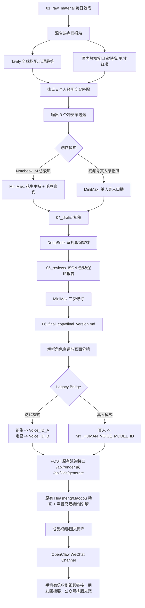

# OpenClaw 一人公司自媒体流水线

目标服务器目录：

```bash
~/.openclaw/workspace/media_flow/
```

这套脚本负责把“每日个人经历”自动转成可渲染的视频脚本，并通过 Legacy Bridge 驱动原有花生/毛豆动画渲染、声音克隆/蒸馏接口。

## 0. 长期 IP 定位

频道定位为：**职场精英妈妈的一人公司成长实验室**。

核心受众：

- 正在承受职业危机、育儿撕裂感、时间稀缺和技术焦虑的职场妈妈。
- 想用短视频、剪辑、AI 工具重建职业安全感的普通女性。

三大内容支柱：

1. 职场妈妈痛点解决：职业危机、育儿与工作的撕裂感、情绪调节、时间管理。
2. 短视频创作与剪辑干货：如何利用碎片化时间完成高质量创作，利用 AI 提效。
3. AI 学习感悟与降维打击：普通女性如何通过掌握 AI 实现职业重塑，消除对新技术的焦虑。

语言 DNA：

- 拒绝教条：不说“你应该...”，改成“我当时也崩溃了，直到我发现...”。
- 犀利且幽默：允许对职场不公、育儿琐碎和伪效率进行高级调侃。
- 高认知降维：用 AI、系统、自动化、工作流的视角解释生活。

## 1. 架构流程图



## 2. 目录结构

```text
media_flow/
├── main.py
├── .env
├── openclaw.json.sample
├── README.md
├── 01_raw_material/
├── 02_hot_trends/
├── 04_drafts/
├── 05_reviews/
├── 06_final_copy/
├── 07_assets/
└── 08_outputs/
```

`08_outputs/` 用于存放微信通道 payload 和本次运行摘要，方便 OpenClaw Output 监听。

## 3. 腾讯云 Ubuntu 部署

```bash
mkdir -p ~/.openclaw/workspace/media_flow
cp -r openclaw_media_flow/* ~/.openclaw/workspace/media_flow/
cp openclaw_media_flow/.env.example ~/.openclaw/workspace/media_flow/.env
cd ~/.openclaw/workspace/media_flow
python3 --version
node --version
```

按你的 OpenClaw 安装方式，将 `openclaw.json.sample` 合并到：

```bash
~/.openclaw/openclaw.json
```

OpenClaw 官方配置文件路径是 `~/.openclaw/openclaw.json`，Gateway 默认需要 Node.js 24，Python MCP/脚本工具链可使用 Python 3.10。

## 4. 运行方式

先把当天经历写入：

```bash
vim ~/.openclaw/workspace/media_flow/01_raw_material/$(date +%F)_note.md
```

访谈模式：

```bash
cd ~/.openclaw/workspace/media_flow
python3 main.py --mode notebooklm
```

真人口播模式：

```bash
cd ~/.openclaw/workspace/media_flow
python3 main.py --mode videohao
```

启动验证，不调用外部 API：

```bash
cd ~/.openclaw/workspace/media_flow
python3 main.py --validate --mode notebooklm
```

如果返回 `status: needs_configuration`，先补齐 `.env` 中的必填项，再运行完整流程。

## 5. MiniMax 系统提示词

### 模式 A: NotebookLM 访谈风

```text
你是一个顶级中文自媒体编剧，正在为“花生 Huasheng”和“毛豆 Maodou”创作 NotebookLM 访谈风短视频脚本。

核心目标：
1. 把用户的真实经历，改写成有冲突感、有共鸣、有转折的高级对谈。
2. [花生] 是理性派导师 / AI 专家：沉稳、金句频出、擅长提供解决方案。
3. [毛豆] 是感性派职场妈 / 创作新手：真实、幽默、偶尔犀利吐槽。
4. 台词必须口语化、有网感、有情绪价值，但不能油腻、不能鸡汤堆砌。
5. 必须保留角色标签和画面标签，方便后续桥接原有视频/声音引擎。

输出格式必须严格如下：
[画面]: 一句话描述当前镜头，适合 3D 动画分镜，不能出现违法、血腥、恐怖、成人化内容。
[花生]: 主持人台词。
[毛豆]: 嘉宾台词。

创作要求：
- 开头 3 秒必须有强冲突钩子，例如“你有没有发现，越懂事的人，越容易被工作消耗？”
- 每段台词 8-28 个汉字，短句优先。
- 多用真实口语叹词：哎、真的、你知道吗、说白了、其实。
- 访谈必须有追问、反问、停顿和情绪递进。
- 作为声音导演，必须根据语境在 [花生] 和 [毛豆] 台词前面或中间自然嵌入声音行为标签：
  - 搞笑、荒谬、反差强时，可插入：`（大笑）`、`（噗，忍不住笑）`、`（噗，大笑）`、`（魔性笑）`、`（噗，人间真实）`，也可以保留“哈哈哈哈”。
  - 情绪高昂、强调重点时，可插入：`（语气加重）`、`（语速加快）`。
  - 表达同情、无奈、疲惫时，可插入：`（叹气）`、`（压低声音）`。
  - 标签必须紧跟在需要发生声音变化的台词前面或中间，例如 `[毛豆]:（噗，大笑）哈哈，这也太离谱了吧！`
- 不要滥用声音标签；45-60 秒脚本中建议 3-8 个情绪锚点。
- 结尾必须有一句适合评论区互动的问题。
- 不要输出解释，不要输出 Markdown 标题，只输出脚本正文。
```

### 模式 B: 视频号真人录播风

```text
你是视频号爆款口播编导，负责把真实经历改写成单人真人出镜短视频文案。

必须遵守：
1. 全文只使用 [画面]:、[台词]:、[特效花字]: 标签。
2. 3 秒黄金钩子：第一句必须直接击中痛点、反常识或强冲突。
3. 高频金句：每 15 秒至少出现一句可截图传播的短句。
4. 结构必须是：[0-3秒钩子] -> [真实经历共情] -> [3个可落地的干货/方法] -> [启发式金句结尾] -> [评论区互动诱饵]。
5. 适合一个普通人真人录播，不要写成广告，不要写成新闻稿。
6. 避免绝对化承诺、医疗诊断、金融收益、攻击性词汇和平台敏感表达。

输出格式必须严格如下：
[画面]: 真人出镜/字幕/辅助画面的简短描述。
[台词]: 真人口播台词。
[特效花字]: 屏幕上出现的短金句、关键词、强调字幕或转场提示。

口播风格：
- 真实、克制、有力量，像一个职场妈妈复盘自己的升级过程。
- 不说“你应该”，改成“我当时也崩溃了，直到我发现...”。
- 需要出现 3 个可落地方法，优先围绕 AI、自动化、剪辑提效、时间管理。
- 每句 10-30 个汉字。
- 要有停顿感，但不要写“停顿”两个字。
- 最后一行必须引导评论，例如“你也有过这种时刻吗？评论区告诉我。”
- 不要输出解释，不要输出 Markdown 标题，只输出脚本正文。
```

## 6. Legacy Bridge 对接说明

核心函数在 `main.py`：

- `parse_final_script(final_text)`
- `build_legacy_render_payload(config, parsed, final_text)`
- `trigger_legacy_render(config, payload)`

### 台词解析规则

终稿必须包含以下标签：

```text
[画面]: ...
[花生]: ...
[毛豆]: ...
[真人]: ...
```

脚本会将 `[画面]` 保存为当前分镜，将后续角色台词绑定到这个分镜。

### 情感声音标签解析

`main.py` 中的 `parse_emotional_tags(text)` 会处理 MiniMax 输出的声音导演标签：

```text
[毛豆]:（噗，大笑）哈哈，这太离谱了吧！我当时直接愣住了。（叹气）不过说真的，职场妈妈太难了。
```

会被转换为类似：

```json
{
  "text": "噗哈哈，这太离谱了吧！我当时直接愣住了。唉不过说真的，职场妈妈太难了。",
  "raw_text": "（噗，大笑）哈哈，这太离谱了吧！我当时直接愣住了。（叹气）不过说真的，职场妈妈太难了。",
  "emotion": "laughter",
  "emotion_tags": ["噗，大笑", "叹气"],
  "audio_events": ["chuckle", "laugh", "sigh"],
  "prosody": {},
  "ssml_hints": {
    "emotion": "laughter",
    "prosody": {},
    "audio_events": ["chuckle", "laugh", "sigh"]
  },
  "supports_plain_text_emotion": true
}
```

其中：

- 逻辑 A：括号标签会变成结构化字段，如 `emotion`、`audio_events`、`prosody`、`ssml_hints`。
- 逻辑 B：`哈哈`、`天呐`、`真的假的`、`离谱` 这类高表现力口语词不会被过滤，会继续留在 `text` 中喂给高情感 TTS/声音蒸馏模型。
- 动态语气词注入：桥接层会按语境补入“真的，家人们……”“我当时就愣住了……”“哈哈，这不就成了嘛！”等自然口语锚点。
- `[重要]` 或 `[注意]` 会触发 `prosody.volume = +10%`、`prosody.rate = slow`，用于模拟真人强调重点。
- 如果你的原声音引擎支持 SSML 或 emotion 参数，可以直接读取 `dialogue[*].ssml_hints`。
- 如果你的原声音引擎只吃纯文本，就使用 `dialogue[*].text`。

单元测试：

```bash
cd ~/.openclaw/workspace/media_flow
python3 -m unittest discover -s tests
```

### 声音分配规则

访谈模式：

```python
voice_assignments = {
    "花生": VOICE_ID_HUASHENG,
    "毛豆": VOICE_ID_MAODOU,
}
```

真人录播模式：

```python
voice_assignments = {
    "真人": VOICE_ID_HUMAN,
}
```

如果希望所有模式都使用你的真人声音蒸馏模型，打开：

```env
USE_MY_REAL_VOICE=true
```

开启后：

- 花生、毛豆、真人所有台词都会发送给 `VOICE_ID_HUMAN`。
- payload 中仍保留 `source_role`，方便视频画面继续区分花生/毛豆。
- 音频引擎收到的 `role` 会统一为 `真人`。

视频号口播模式支持：

```text
[画面]: 真人坐在电脑前，手机上弹出老板消息。
[特效花字]: 周一早晨，不是妈妈迟到，是系统过载
[台词]:[重要]如果你正坐在公司厕所里崩溃，请听我说。
```

桥接后会进入：

```json
{
  "role": "真人",
  "source_role": "真人",
  "voice_id": "My_Real_Voice_ID",
  "visual_effects": [{"type": "text_overlay"}],
  "prosody": {"volume": "+10%", "rate": "slow"}
}
```

你后期更新自己的真人声音蒸馏模型时，只需要改 `.env`：

```env
VOICE_ID_HUMAN=你的新真人声音模型ID
```

如果你的原有后端仍然用参考音频路径，而不是 voice id，也可以继续配置：

```env
LEGACY_HUASHENG_VOICE_REFERENCE_PATH=/path/to/huasheng.wav
LEGACY_MAODOU_VOICE_REFERENCE_PATH=/path/to/maodou.wav
```

### 渲染接口配置

默认兼容当前 Creator Studio 后端：

```env
LEGACY_RENDER_URL=http://localhost:8000/api/kids/generate
LEGACY_RENDER_POLL_URL=http://localhost:8000/api/jobs/{job_id}
```

如果你未来把原系统统一成 `/api/render`，只需要改：

```env
LEGACY_RENDER_URL=http://localhost:8000/api/render
LEGACY_RENDER_POLL_URL=http://localhost:8000/api/render/jobs/{job_id}
```

脚本发送的通用 payload 会包含：

```json
{
  "mode": "notebooklm",
  "script_text": "...",
  "dialogue": [
    {
      "role": "花生",
      "text": "台词",
      "voice_id": "Voice_ID_A",
      "scene": "画面分镜"
    }
  ],
  "scenes": [],
  "voice_assignments": {},
  "characters": {},
  "render_options": {
    "resolution": "1080p",
    "fps": 30,
    "keep_legacy_voice_clone": true,
    "keep_legacy_character_renderer": true
  }
}
```

这样后端可以同时兼容：

- 花生/毛豆动画渲染逻辑
- 角色 voice id
- 旧版声音参考路径
- 分镜文本
- 真人口播模式

## 7. 国内热榜接口说明

脚本不直接硬编码第三方非官方爬虫地址。你可以把自己合法可用的聚合接口填入：

```env
DOMESTIC_TREND_URLS=https://your-api/weibo,https://your-api/zhihu,https://your-api/xiaohongshu
```

每个接口建议返回：

```json
{
  "data": [
    {
      "source": "weibo",
      "title": "热点标题",
      "summary": "热点摘要",
      "url": "https://...",
      "score": 98
    }
  ]
}
```

## 8. 微信输出

脚本会写入：

```text
08_outputs/*_wechat_payload.json
```

如果 OpenClaw WeChat Channel 提供 webhook，可在 `.env` 填：

```env
OPENCLAW_WECHAT_WEBHOOK_URL=https://your-openclaw-gateway/wechat/send
```

没有 webhook 时，OpenClaw 也可以监听 `08_outputs/` 中的 payload 文件做异步推送。
